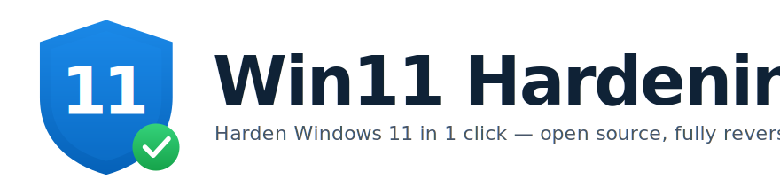
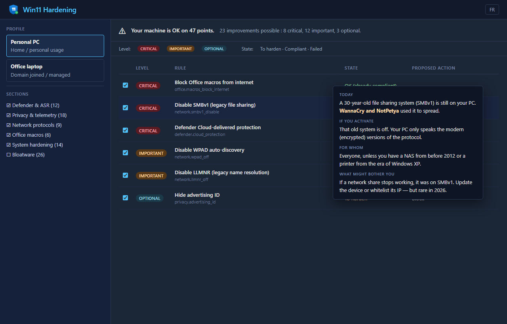
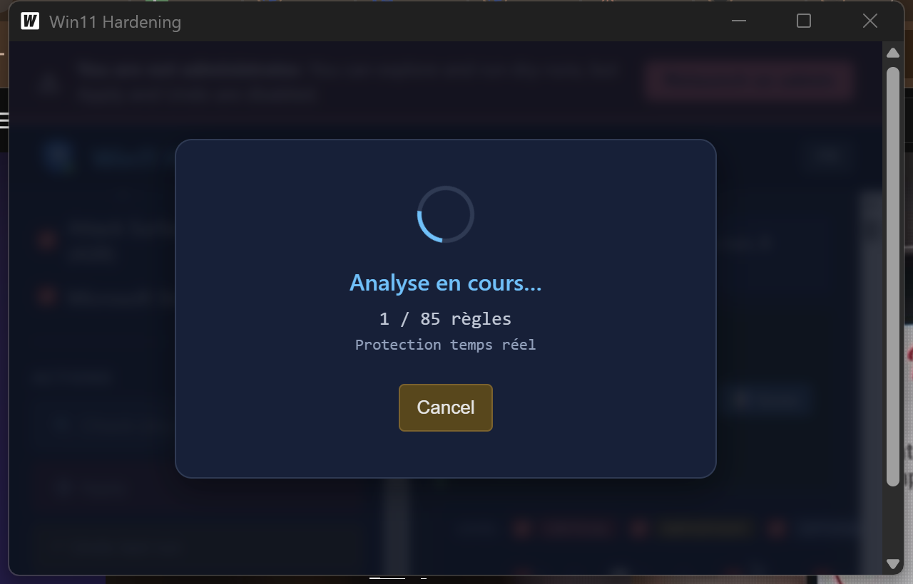
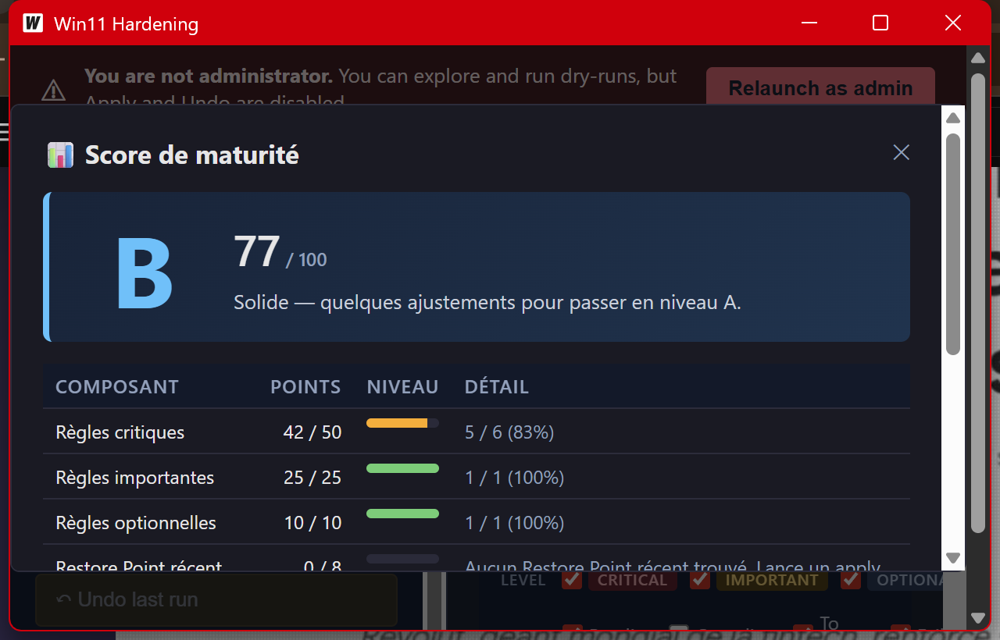
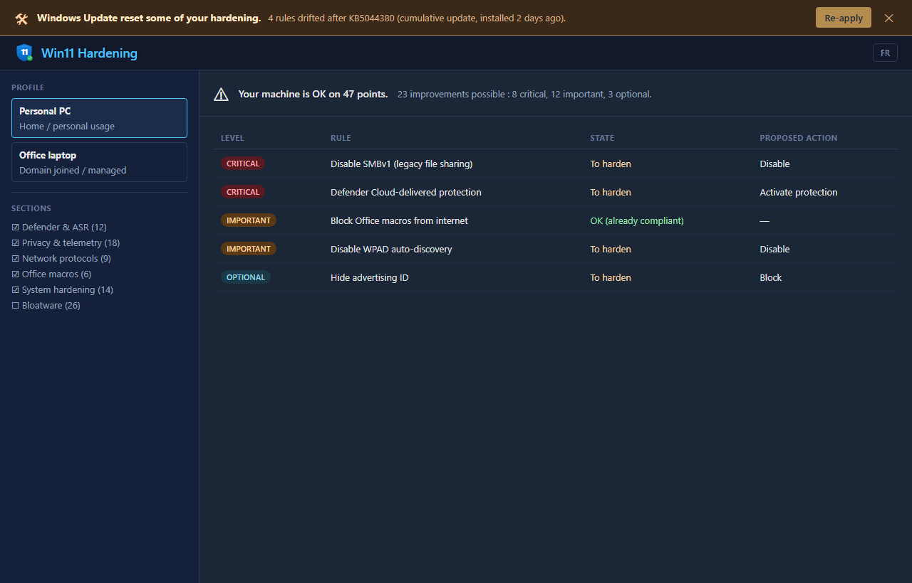
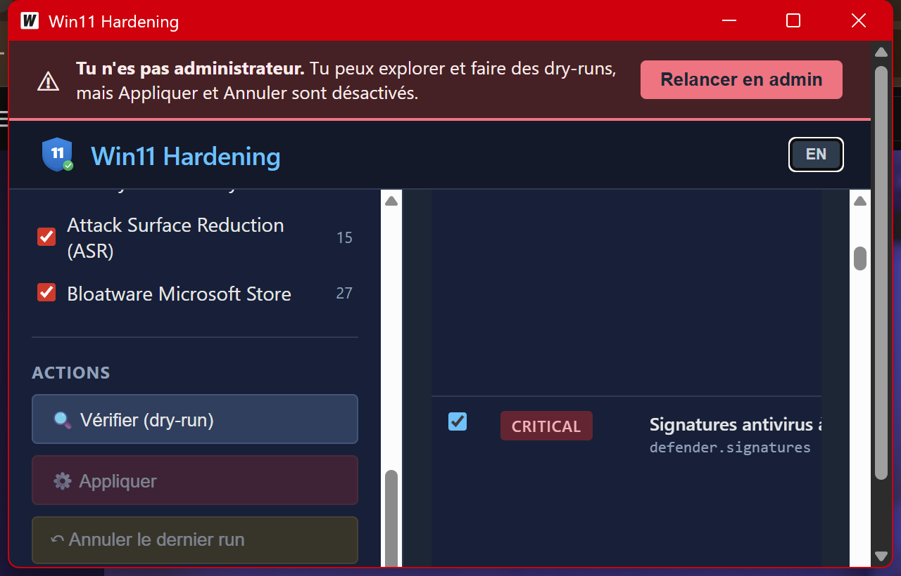

<div align="center">



### Sécurise ton Windows 11 en 3 clics. Sans ligne de commande. Sans rien casser.

**Une appli desktop open source qui explique chaque réglage de sécurité en français normal, l'applique en un clic, et annule tout si tu changes d'avis.**

À la sortie de la boîte, **Windows 11 n'est pas durci** contre les attaques modernes. Ce projet comble ce trou — il amène ton PC perso au niveau d'une machine d'entreprise correctement administrée.

[](https://github.com/koff75/win11-hardening/releases/latest)
[](https://github.com/koff75/win11-hardening/releases/latest)
[](https://github.com/koff75/win11-hardening/stargazers)
[](LICENSE)

[](https://github.com/koff75/win11-hardening/actions)
[](https://github.com/koff75/win11-hardening)
[](mappings/baselines.yaml) [](mappings/baselines.yaml) [](mappings/baselines.yaml)
[](#)

### [⬇️ **Télécharger pour Windows 11**](https://github.com/koff75/win11-hardening/releases/latest) · [🇬🇧 **English version**](README.md)


</div>

---

## ⚡ Comment ça marche — 3 étapes

```
1. Télécharge Win11Hardening.zip
2. Clic droit → Extraire → Double-clic sur run-as-admin.bat
3. L'appli s'ouvre. Clique "Vérifier" → vois ce qu'il y a à corriger → "Appliquer".
```

**Zéro installation.** Pas de service, rien de touché tant que tu ne cliques pas. Effacer le dossier = désinstallé. **Aucune connaissance ligne de commande nécessaire.**

---

## 🎯 Pourquoi Windows 11 a besoin d'être durci

Une installation Windows 11 fraîche en 2026 livre encore :

- **SMBv1**, **NTLMv1**, **WPAD** — des protocoles dont les noms apparaissent dans tous les post-mortem "comment WannaCry / NotPetya se sont propagés".
- **Télémétrie, pubs, advertising-ID** intégrés aux Paramètres, envoyés à Microsoft et Bing tous les jours.
- **Macros Office** qui s'auto-exécutent depuis n'importe où sur Internet.
- **Cache de credentials** qui permet à un seul phishing de fuiter ton mot de passe domaine.
- **Règles ASR Microsoft Defender** qui existent mais sont éteintes par défaut.

Ce n'est pas une question de configuration — ce sont des choix Microsoft, pour la rétrocompat. **Win11 Hardening les change**, en t'expliquant chacun en langage simple, et te laisse annuler n'importe quelle règle individuellement.

|                                | Réglages manuels | O&O ShutUp10++ | Scripts tweaks | **Win11 Hardening** |
| ------------------------------ | :--------------: | :------------: | :------------: | :-----------------: |
| Explications en français clair |         ❌         |       ⚠️        |        ❌        |          ✅          |
| Survol règle = détail complet  |         ❌         |       ❌        |        ❌        |          ✅          |
| Réversible règle par règle     |         ❌         |       ⚠️        |        ❌        |          ✅          |
| Restore Point auto             |         ❌         |       ❌        |        ❌        |          ✅          |
| Re-test après apply            |         ❌         |       ❌        |        ❌        |          ✅          |
| Détecte le drift Windows-Update |         ❌         |       ❌        |        ❌        |          ✅          |
| Mappé CIS / ANSSI / MS         |         ❌         |       ❌        |        ⚠️        |          ✅          |
| Open source, audité            |         ✅         |       ❌        |        ⚠️        |          ✅          |

---

## 📸 Ce que tu vois dans l'appli

<table>
<tr>
<td width="50%" align="center">
<b>1. Le dashboard te dit ce qui compte</b><br/>

<sub>Ta machine est OK sur X points · N améliorations possibles. L'appli détecte automatiquement laptop / domaine / etc.</sub>
</td>
<td width="50%" align="center">
<b>2. Survol règle = explication en français</b><br/>

<sub>Aujourd'hui / Si tu actives / Pour qui / Ce qui peut t'embêter. Pas de regkey, pas de jargon.</sub>
</td>
</tr>
<tr>
<td align="center">
<b>3. Clic "Appliquer", progression réelle</b><br/>

<sub>Restore Point d'abord. Puis chaque règle avec son résultat. Annulable à tout moment.</sub>
</td>
<td align="center">
<b>4. Score de maturité A/B/C/D</b><br/>

<sub>À quel point ta machine est durcie, avec étapes concrètes pour gagner des points.</sub>
</td>
</tr>
<tr>
<td align="center">
<b>5. Windows Update a remis un truc à zéro ? Tu sauras.</b><br/>

<sub>L'appli re-vérifie après chaque Windows Update et te prévient si Microsoft a discrètement défait un réglage.</sub>
</td>
<td align="center">
<b>6. Bascule de langue en un clic</b><br/>

<sub>Bouton FR/EN en haut à droite. Toute l'UI bascule instantanément — y compris les tooltips.</sub>
</td>
</tr>
</table>

---

## 🔥 Ce qui rend ce projet différent

### 🧠 Zéro jargon. Conçu pour les humains.

Chaque règle a une explication 4 lignes en français. Survole une règle dans le tableau pour la lire.

> **Aujourd'hui** — Un système de partage de fichiers vieux de 30 ans est encore sur ton PC. WannaCry et NotPetya l'ont utilisé pour se propager.
> **Si tu actives** — Ce vieux système est éteint. Ton PC ne parle que les versions modernes (chiffrées).
> **Pour qui** — Tout le monde, sauf si tu as un NAS d'avant 2012.
> **Ce qui peut t'embêter** — Si un partage réseau ne marche plus, c'était du SMBv1. Mets à jour le NAS ou whitelist.

### 🛡️ 6 couches de sécurité avant qu'une règle change ton système

1. **Auto-skip contextuel** — Laptop ? hibernation gardée. Domaine d'entreprise ? on ne renomme pas Administrator.
2. **Detection feature in-use** — Session RDP active ? refus de désactiver RDP. Partage SMB1 actif ? refus de tuer SMBv1.
3. **Restore Point Windows** — Créé automatiquement avant tout apply.
4. **Snapshot pre/post** — 25+ réglages critiques capturés. Tu vois *exactement* ce qui a changé.
5. **Re-test post-apply** — Si un réglage n'a pas vraiment pris effet, rollback automatique.
6. **Surveillance 24h** — L'appli regarde Event Viewer pendant 24h après apply. Bandeau si SMB / Defender / imprimantes commencent à pleurer.

### 🔄 Détecte quand Windows Update casse ton durcissement

Les Cumulative Updates Microsoft réinitialisent régulièrement des réglages registre. **Aucun autre outil de durcissement Windows 11 ne capte ça.**

L'appli enregistre une tâche système qui se déclenche après chaque installation Windows Update réussie. Elle re-lance toutes tes règles activées et les compare à ta dernière baseline connue. Si quelque chose a dérivé, tu vois un bandeau au prochain démarrage avec un "Re-appliquer" en un clic.

### ↩️ Tout réversible depuis la GUI

La barre **Historique** liste chaque run. Clique ↶ à côté d'un run pour le rollback. Pas de regret.

### 📊 Mappé contre les standards publics

Couverture vis-à-vis de trois baselines publiques de durcissement Windows 11 :

- **CIS Microsoft Windows 11 Enterprise Benchmark** v3.0.0 — 62% de couverture
- **Microsoft Security Baseline** Win11 24H2 — 65%
- **ANSSI** Recommandations Windows — 42%

Tu n'appliques pas mes idées maison. Tu appliques des règles déjà présentes dans les baselines de l'industrie.

---

## 🤔 FAQ

**Je suis pas tech — c'est pour moi ?** Oui. L'appli explique chaque réglage en français normal. Tu survoles, tu lis, tu décides. Si tu changes d'avis, ↶ pour annuler.

**Ça va casser mes apps ?** Peu probable. Restore Point d'abord, detection feature in-use, rollback auto si une règle déconne. Et chaque règle te prévient si elle peut casser un truc spécifique (genre "ça peut casser ton vieux NAS").

**Compatible Windows 11 Home ?** Oui. La plupart des règles marchent sur Home et Pro. Les règles qui exigent un domaine sont auto-décochées.

**100% local ?** Oui. Zéro appel réseau. Toutes tes données restent sur ta machine.

**Gratuit / open source ?** Oui. WTFPL — fais ce que tu veux.

**Le binaire n'est pas signé Microsoft, c'est risqué ?** SHA256 publié à côté du ZIP. Build reproductible depuis les sources : tu peux le compiler toi-même avec `go build`.

---

## 🛠 Pour les devs / IT admins

Un binaire CLI (`harden-engine.exe`) accompagne la GUI dans le même ZIP. Lance-le depuis PowerShell pour scripter des applies en CI/CD ou déployer en batch :

```powershell
.\harden-engine.exe apply --dry-run --profile personal --severity critical
.\harden-engine.exe coverage
.\harden-engine.exe undo --since 168h
```

Référence CLI complète : `harden-engine.exe --help`. Format des manifests et comment ajouter une règle : [`docs/`](docs/).

**Stack** : Go 1.26 · Wails 2 · PowerShell 5.1 · manifests YAML · journal NDJSON crash-safe · 12 packages Go · 98 Pester + 100+ tests Go + property-based + fuzz + gosec.

---

## 📖 Plus

[`docs/smoke-test.md`](docs/smoke-test.md) · [`docs/manual-e2e-checklist.md`](docs/manual-e2e-checklist.md) · [`mappings/baselines.yaml`](mappings/baselines.yaml) · [`README.md`](README.md)

---

<div align="center">

### Utile ? **Une ⭐ aide le projet à atteindre les gens qui en ont besoin.**

[](https://star-history.com/#koff75/win11-hardening&Date)

</div>
