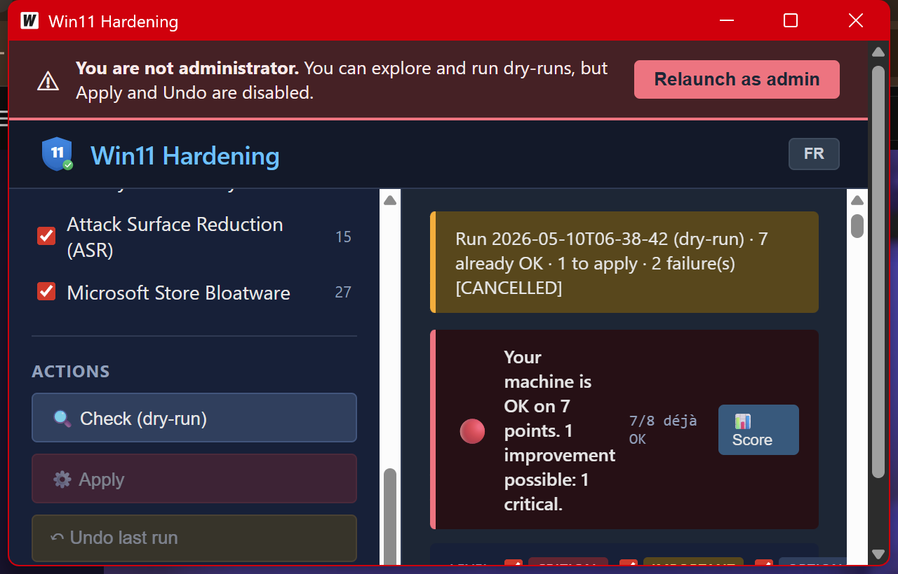

<div align="center">

# 🛡️ Harden-Win11

**Harden your Windows 11 in one click. Without breaking your PC.**

95 security rules, explained in plain English. You see exactly what changes before you click. You can undo everything.

[](https://github.com/koff75/harden-win11/releases/latest)
[](https://github.com/koff75/harden-win11/actions)
[](https://github.com/koff75/harden-win11)
[](https://github.com/koff75/harden-win11)
[](LICENSE)

[**📥 Download**](https://github.com/koff75/harden-win11/releases/latest) · [**📖 Docs**](#-documentation) · [**🇫🇷 Version française**](README.fr.md)



</div>

---

## ⚡ In 30 seconds

```powershell
# 1. Download the ZIP from Releases
# 2. Extract
# 3. Double-click run-as-admin.bat
```

That's it. No installation, no service, nothing touched until you click.

---

## 🎯 Why this tool

Most "Windows 11 hardening" guides:
- ❌ Tell you to edit the registry by hand
- ❌ List 200 settings in technical jargon
- ❌ Don't tell you what will break your apps
- ❌ No clean rollback

**Harden-Win11**:
- ✅ A GUI that explains every rule **in plain language** ("Today: ..." / "If you activate: ..." / "What might bother you: ...")
- ✅ **Undoes everything** in one click (NDJSON journal + per-rule `.undo.ps1` + Windows Restore Point)
- ✅ Detects if you're using RDP / legacy SMB / etc. and **refuses to apply** a rule that would break your current usage
- ✅ Watches **for 24h after** your apply to spot anything crying in Event Viewer
- ✅ **A/B/C/D maturity score** to measure how hardened your machine is
- ✅ Mapped against **CIS Win11**, **ANSSI**, **MS Security Baseline** (not home-grown)
- ✅ Available in **English and French** (auto-detect, switch anytime)

---

## 📸 Preview

<table>
<tr>
<td width="50%">

**User-friendly action card** — every rule explains in plain language
what it actually changes.


</td>
<td width="50%">

**Maturity score** — A/B/C/D weighted, with concrete actions
to gain points.


</td>
</tr>
<tr>
<td>

**Standards coverage** — how many rules map to
CIS / ANSSI / MS Security Baseline.


</td>
<td>

**24h watchlist** — monitors Event Viewer after your apply to
detect functional breakage.


</td>
</tr>
</table>

---

## 🚀 Quick Start

### Option 1: GUI (recommended)

1. Download `Harden-Win11-X.Y.Z.zip` from the [Releases page](https://github.com/koff75/harden-win11/releases/latest)
2. Extract anywhere
3. Double-click `run-as-admin.bat`

The GUI detects your context (laptop / desktop / AD-joined), suggests a profile, and lets you decide rule by rule.

### Option 2: CLI

```powershell
# See what would change — without touching anything
.\harden-engine.exe apply --dry-run --parallel 4

# Maturity / coverage score
.\harden-engine.exe coverage

# Targeted apply
.\harden-engine.exe apply --profile personal --severity critical

# Undo everything done in the last 7 days
.\harden-engine.exe undo --since 168h
```

---

## 🔥 Killer features

### 🛡️ 6 safety layers before any rule changes your system

1. **Context-aware auto-skip**: laptop ⇒ we don't disable hibernation. AD-joined ⇒ we don't rename Administrator.
2. **Feature in-use detection**: if you have an active RDP session ⇒ refuses to disable RDP.
3. **Windows Restore Point** automatically created before apply.
4. **Pre/post snapshot**: 25+ registry keys + Defender + Services captured. `harden-engine snapshot diff <runID>` shows exactly what changed.
5. **Post-apply re-test**: if action returned ok but post-test says non-compliant (GPO override, lying action), automatic rollback.
6. **24h watchlist**: scheduled task monitors Event Viewer (SMB / Defender / NetBIOS / Schannel / PrintService) with **adaptive thresholds** (learns your normal baseline).

### 🧠 Maximum vulgarization

Every key rule has 4 plain-English sentences:
- **Today**: current situation
- **If you activate**: what changes concretely
- **For whom**: target profile
- **What might bother you**: concrete impact

No jargon, no registry key names, no raw numbers. You decide in 5 seconds.

### 📊 Measurable

```
$ harden-engine coverage
Total rules harden-win11 : 95
Rules with ≥1 mapping    : 66 (69%)

[CIS Win11 Enterprise v3.0.0]
  Rules covered : 59 / 95 (62%)
  Unique controls cited : 65

[ANSSI Windows]
  Rules covered : 40 / 95 (42%)

[MS Security Baseline 24H2]
  Rules covered : 62 / 95 (65%)
```

### ↩️ Everything is undoable

```powershell
# Undo last run
harden-engine undo

# Undo a specific rule
harden-engine undo --rule-id defender.cloud_protection

# Undo 7 days of changes (LIFO across runs)
harden-engine undo --since 168h
```

---

## 🏗️ Architecture

```
manifests/         95 rules in YAML (one file per section)
engine/actions/    PowerShell snippets per rule (action / test / undo)
pkg/engine/        Go library: manifest, executor, snapshot, watchlist, ...
cmd/harden-engine/ CLI binary (Cobra)
cmd/harden-gui/    GUI binary (Wails)
mappings/          CIS / ANSSI / MS Security Baseline mapping
```

11 Go packages, **98 Pester tests + ~50 Go tests** + property-based + fuzz + benchmarks + gosec scan.

---

## 🤔 FAQ

**Will I break my PC?**
Unlikely. Restore Point created before apply, crash-safe NDJSON journal, per-rule undo. And if the action "lied", post-apply re-test triggers auto-rollback.

**Does it work on Windows 11 Home?**
Yes. Most rules work on Home and Pro. A few (rename Administrator) make less sense in AD environments → auto-unchecked.

**Free / open source?**
Yes. WTFPL license — do whatever you want. No warranty, you are responsible for what you run.

**The binary isn't signed by a known publisher, is that risky?**
The binary is self-signed to identify the version. You can verify the SHA256 published next to the ZIP. Reproducible build via `go build` from this repo + public GitHub Actions.

**How to contribute?**
Run the tests (`go test ./... && Invoke-Pester engine/actions`), open a PR. Manifest format is documented in [`docs/`](docs/).

---

## 📖 Documentation

- [`README.fr.md`](README.fr.md) — Version française
- [`docs/smoke-test.md`](docs/smoke-test.md) — Win11 Home/Pro VM checklist before release
- [`docs/manual-e2e-checklist.md`](docs/manual-e2e-checklist.md) — manual GUI verification (admin)
- [`docs/test-report-2026-05-09.md`](docs/test-report-2026-05-09.md) — bug hunt session report
- [`mappings/baselines.yaml`](mappings/baselines.yaml) — detailed CIS / ANSSI / MS mapping

---

## 🙋 v1 (legacy PowerShell script)

The original `Harden-Win11.ps1` script is still in the repo for simple one-file usage without a Go build. Less safe than v2 (no undo, no journal, no profiles) but it's just one file.

---

<div align="center">

**Find this useful? A ⭐ on GitHub helps spread the word.**

</div>
